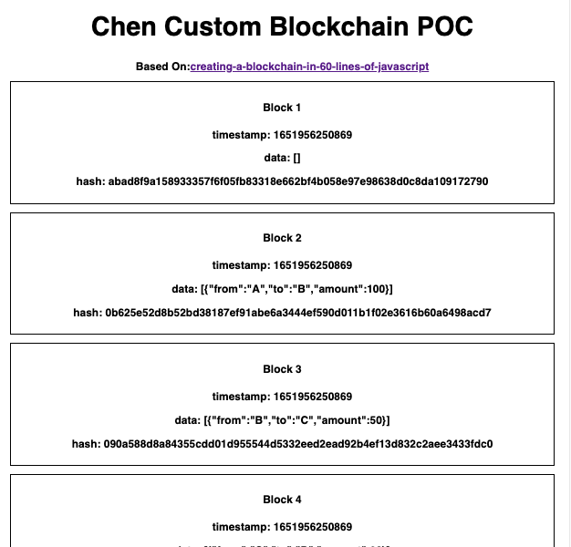

d ---
sidebar_position: 1
---

# Blockchain Creation POC

## Purpose
Fun POC for learn the Crypto world, for create a new blockchain and generate a random one (with minting).
- The project is based on Typesscript and React.

## Codesanbox Repo
[Link](https://codesandbox.io/s/chen-blockchain-poc-h2qqqr)

## Images

